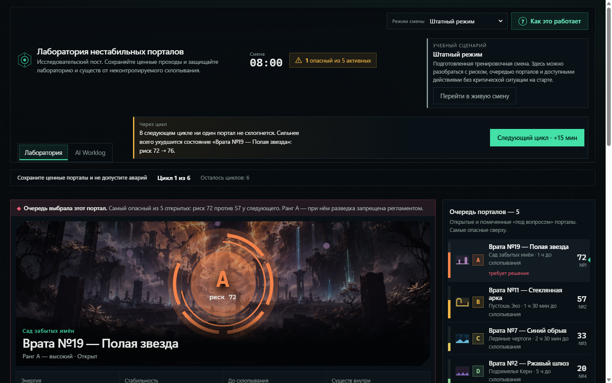

# Лаборатория нестабильных порталов

Веб-приложение для смотрителя лаборатории, где открываются магические порталы.
Показывает список порталов, считает риск по понятной формуле, объясняет каждое
решение и не даёт совершить нелогичное действие.

Тестовое задание на вакансию AI-first Developer в MOX.

**Живая версия:** https://spisusha.github.io/portal-lab/



## Что можно сделать за минуту

1. Открыть приложение — встретит вступление из четырёх коротких шагов: роль и
   смысл порталов, показатели, решения и итог смены. Его можно вернуть кнопкой
   «Как это работает».
2. Центральная **камера портала** сама выбирает самый опасный объект,
   объясняет причину выбора и показывает одно рекомендуемое действие.
3. Нажать «Стабилизировать» — поверх интерфейса сразу появятся изменения
   «Риск 72 → 60» и «Стабильность 30 → 55»; журнал остаётся архивом, а не
   единственным источником обратной связи.
4. Переключить «Режим смены» на «Критическую ситуацию» — там есть
   портал ранга S, у которого разведка запрещена, и портал, который схлопнется
   за один цикл. Под переключателем всегда написано, что это за режим:
   три подготовленных набора помечены как **учебные сценарии**, живая смена —
   как основной режим.
5. Нажать «Закрыть портал» у портала с существами внутри — приложение
   предупредит и потребует подтверждения.
6. Выбрать «Живую смену» — приложение выдаст новый код вида `PL-7K42`,
   соберёт по нему пять порталов из пяти разных миров, выдаст директиву
   и расписание событий. Время здесь идёт само, но только после нажатия
   «Начать живую смену»: цикл в 15 лабораторных минут проходит за 60 реальных
   секунд. Смену можно переиграть по тому же коду или передать ссылкой.
7. Пролистать смену вниз до раздела **«Частые вопросы»** — короткие ответы
   на то, что обычно спрашивают после первой смены: почему кнопка серая,
   чем режимы отличаются, куда пропал портал из очереди. Полное вступление
   возвращается кнопкой «Как это работает» в шапке.
8. Открыть вкладку **AI Worklog** — отчёт о том, как приложение делалось.

Смена конечная: старт в 08:00, один цикл — 15 минут, всего шесть циклов.
После шестого цикла или после того, как активных порталов не осталось,
открывается экран «Смена завершена» с итогами. Шесть циклов — короткая
демонстрационная продолжительность, а не попытка изобразить восьмичасовую
смену.

Канон мира: лаборатория удерживает порталы для научных исследований, а
существа внутри — нейтральные живые обитатели других миров. Хороший результат
смотрителя — сохранить ценные проходы, не допустить аварий и уберечь существ;
если портал безнадёжен, контролируемое закрытие лучше неконтролируемого
схлопывания.

Подробные вычисления риска не мешают принимать решение: сверху стоит одна
человеческая фраза о том, что именно не так, а арифметика лежит в
свёрнутом блоке «Как рассчитан риск».

## Запуск

Нужен Node.js 20 или новее.

```sh
git clone https://github.com/spisusha/portal-lab.git
cd portal-lab
npm install
npm run dev
```

Приложение откроется на `http://localhost:5173/portal-lab/`.

| Команда | Что делает |
|---|---|
| `npm run dev` | локальный запуск |
| `npm test` | тесты логики |
| `npm run build` | production-сборка в `dist/` |
| `npm run preview` | просмотр собранной версии |

**Секретов и переменных окружения проект не требует.** Внешние API не
используются, все данные локальные — хранить в коде нечего.

## Режим «Живая смена»

Кроме трёх демонстрационных наборов в переключателе «Режим смены» есть
**Живая смена** — переигрываемая смена, которая целиком строится по коду вида
`PL-7K42`. Три демонстрационных сценария при этом не меняются: они остаются
детерминированными и по-прежнему служат проверкой обязательных состояний
задания.

Пример ссылки:

```
https://spisusha.github.io/portal-lab/?mode=live&seed=PL-7K42
```

Открытие такой ссылки воспроизводит ту же начальную смену: те же пять
порталов, те же показатели, те же особенности миров, то же расписание событий
и ту же директиву. Код показан в карточке режима под переключателем и сам
попадает в адресную строку, так что смену можно отправить, ничего не нажимая.

Одна смена — пять порталов из пяти **разных** миров, шесть циклов по 15 минут.
Порталы генерируются не наугад, а по ролям: в смене всегда есть один портал,
который действительно требует решения сейчас, и есть пара спокойных, на фоне
которых видно, что первый именно опасен. Проверка «смена не бессмысленна и не
непроходима» вынесена в `shiftIsPlayable` и покрыта тестом на десятках кодов.

### Откуда берётся случайность

Правило домена не ослаблено: `Math.random` и `Date.now` внутри `src/domain`
по-прежнему запрещены. Единственный источник разброса — строка seed, которую
домен получает уже готовой; внутри работает собственный детерминированный
PRNG (`domain/live/prng.ts`, xmur3 + mulberry32). Новый код придумывает
адаптер `state/liveSeed.ts` через `crypto.getRandomValues` — он же читает и
пишет адресную строку. Поэтому вся генерация тестируется без браузера.

### Живое время

Таймер не запускается вместе с выбором режима. Сначала человек видит код,
директиву и порталы, и только кнопка **«Начать живую смену»** запускает отсчёт.

| Что | Сколько |
| --- | --- |
| Один лабораторный цикл | 15 игровых минут |
| Один цикл в реальном времени | 60 секунд |
| Одна игровая минута | 4 реальные секунды |
| Полная смена из шести циклов | около шести минут без пауз |

Часы в шапке идут поминутно — `08:00`, `08:01`, `08:02`, — а рядом с прогнозом
стоит отсчёт «До следующего цикла · 00:43». Когда отсчёт доходит до нуля,
выполняется тот же переход, который в учебных сценариях делает кнопка: второй
реализации расчёта нет, поэтому прогноз «Через цикл» не может разойтись с
фактом.

Управление: **Пауза** / **Продолжить** в карточке режима и вторичная
**«Завершить цикл сейчас»** рядом с прогнозом — она пропускает остаток цикла,
о чём написано под кнопкой заранее.

Таймер сам останавливается, когда открыта инструкция, открыто подтверждение,
человек ушёл во вкладку AI Worklog, вкладка браузера скрыта или смена
завершилась. Причина всегда написана словами. После инструкции или
подтверждения время продолжается само; после скрытой вкладки и ручной паузы
нужно нажать «Продолжить» — изменение состояния не должно оказаться
неожиданностью. Пропущенное в фоне время не применяется: порталы не
схлопываются, пока человека нет.

`prefers-reduced-motion` гасит пульсацию индикатора, но не останавливает само
время: это поведение, а не украшение.

### Особенности миров

В живой смене у каждого из девяти миров одна особенность. Она написана рядом
с названием мира — и в камере портала, и в строке очереди, — то есть видна до
решения, а не после. Скрытых поправок нет: все числа отсюда попадают в прогноз
«Через цикл», в строку последствия на кнопке и в журнал.

| Мир | Особенность | Что делает |
|---|---|---|
| Сумеречная топь | Топь тянет вниз | время до схлопывания уходит вдвое быстрее: −30 мин за цикл |
| Ледяные чертоги | Морозный контур | контур проседает медленнее (−1), но стабилизация даёт только +15 |
| Пустошь Эхо | Эхо резонанса | энергия набирается быстрее: +5 за цикл |
| Подземелья Керн | Каменный свод | энергия сама не растёт, но и стабилизация её не гасит |
| Сад забытых имён | Тихий сад | стабилизация даёт +35, но научных данных вдвое меньше |
| Бездна Аркхан | Разлом Аркхан | контур проседает вдвое быстрее (−6), зато данных вдвое больше |
| Пепельные пустоши | Пепельный шлейф | энергия растёт быстрее (+4), но стабилизация гасит её на 20 |
| Залы Немой | Немая тишина | контур не проседает сам, но энергия набирается быстрее (+4) |
| Море Сфер | Сферы-поплавки | наблюдения дают в 1,5 раза больше данных, стабилизация — только +20 |

Особенности применяются **только** к живой смене. У порталов трёх
демонстрационных сценариев поле особенности пустое, и формулы работают ровно
так же, как в версии 1.0.

### События между циклами

На каждый переход между циклами приходится не больше одного события, и всё
расписание задано кодом смены заранее. Событие объявляется в уже существующем
блоке «Через цикл» **до** нажатия кнопки, а после перехода строка с числами
попадает в журнал. Никаких всплывающих окон.

Семь типов: энергетический всплеск, просадка контура, спокойное окно, резонанс
двух порталов, миграция существ, усиление стабилизаторов, поверка приборов.
Первый переход всегда тихий — человеку дают осмотреться. Миграция переносит
существ между порталами и никогда не меняет их общее число.

Прогноз не может разойтись с фактом по построению: и блок «Через цикл», и
редьюсер зовут одну и ту же функцию `domain/simulate.ts`, считающую весь
переход целиком. Это проверяется тестом, который сравнивает не тексты, а
состояния порталов.

### Директива смены

Каждая живая смена получает одну дополнительную задачу лаборатории — она
показана компактной строкой рядом с прогрессом смены:

- не допустить ни одного схлопывания;
- завершить смену без потери существ;
- вернуть минимум двух наблюдателей;
- сохранить открытыми минимум три портала;
- завершить смену без критических порталов;
- стабилизировать минимум три разных портала.

Директива выбирается по коду и в начальном состоянии обязана быть выполнимой:
за это отвечает `directiveFeasible`, и генератор не отдаёт смену, пока это не
так. Главную цель она не заменяет — в итоговом счёте это 10 очков из 100,
поэтому смена без потерь остаётся сильной и с невыполненной директивой.

### Итог живой смены

Для живого режима работает свой итоговый отчёт со счётом и рангом. Формула
лежит в `domain/live/score.ts`, в компонентах вычислений нет.

```
счёт = безопасность существ (0–40)
     + сохранность порталов (0–30)
     + научные данные       (0–20)
     + директива            (0–10)
```

- **безопасность существ** — доля спасённых от общего числа; управляемое
  закрытие с существами внутри считается потерей так же, как схлопывание;
- **сохранность порталов** — доля порталов, не схлопнувшихся за смену;
  управляемое закрытие потерей **не** считается;
- **научные данные** — стабилизации, отчёты вернувшихся наблюдателей и
  порталы, удержанные открытыми до конца, с множителем особенности мира;
- **директива** — 10 очков, если выполнена.

| Счёт | Ранг | Словами |
|---|---|---|
| 90–100 | S | образцовая смена |
| 78–89 | A | сильная смена |
| 62–77 | B | рабочая смена |
| 45–61 | C | смена с потерями |
| 0–44 | D | смена сорвана |

Каждый блок показывает не только очки, но и строку объяснения с числами.
Ранг продублирован буквой, словом и числом — успех, как и опасность, не
кодируется одним цветом.

На финальном экране три действия:

- **Повторить эту смену** — тот же код, лаборатория с нуля;
- **Новая живая смена** — новый код;
- **Поделиться сменой** — копирует ссылку с текущим кодом; результат
  подтверждается текстом «Ссылка скопирована», а не сменой иконки.

В ссылке кодируется только сама смена. Последовательность решений в URL не
кладётся: это была бы не ссылка на смену, а сохранённое прохождение, выданное
за результат.

### Разбор решений

Под итогом — компактный таймлайн: номер цикла, портал, выбранное действие,
рекомендация системы на тот момент и краткий фактический результат.

Совпадение с рекомендацией называется совпадением, а расхождение —
расхождением. Рекомендация из `recommend.ts` — эвристика из пяти правил, а не
доказанный оптимум, поэтому разбор не называет её единственно правильной и не
утверждает, что другое действие дало бы лучший результат: чтобы такое
заявлять, пришлось бы досчитать альтернативную смену до конца. Разбор помогает
понять прохождение, а не ругает.

## Как считается риск

```
риск = 0.35 × (100 − стабильность)
     + 0.30 × энергия
     + 0.25 × нехватка времени
     + 0.10 × существа внутри
```

- **нехватка времени** — насколько близко схлопывание относительно горизонта
  в 180 минут. Портал, которому осталось больше трёх часов, временнóго
  давления не создаёт.
- **существа внутри** — по 20 пунктов за каждое, максимум 100.

Функция расчёта возвращает не одно число, а разбор: сколько пунктов дал каждый
фактор. Этот разбор показывается прямо в карточке портала — видно, из чего
сложился итог.

Итог переводится в ранг врат:

| Риск | Ранг | Словами |
|---|---|---|
| 0–15 | E | минимальный |
| 16–32 | D | низкий |
| 33–50 | C | умеренный |
| 51–68 | B | повышенный |
| 69–84 | A | высокий |
| 85–100 | S | критический |

В интерфейсе ранг S называется **критическим**, а A — **опасным**. В штатном
сценарии A-портал не считается критическим.

## Что запрещено и почему

Запреты живут в одном месте — `src/domain/rules.ts`. Каждая проверка
возвращает не только «можно/нельзя», но и причину. Поэтому кнопка
недоступного действия **неактивна, а причина написана рядом — до нажатия**.
Пользователь не натыкается на ошибку постфактум.

| Действие | Запрещено когда |
|---|---|
| Стабилизировать | портал закрыт или схлопнулся; стабильность уже 95 (предел контура) |
| Отправить наблюдателя | ранг A или S; портал закрыт или схлопнулся; наблюдатель уже внутри |
| Закрыть портал | портал закрыт или схлопнулся. Если внутри существа или наблюдатель — требуется подтверждение |
| Пометить «под вопросом» | портал закрыт, схлопнулся или уже помечен |

## Как устроен проект

```
src/domain/    вся логика: чистый TypeScript, без React
  types.ts       модель портала, статусы, действия
  risk.ts        формула риска и разбор на слагаемые
  rules.ts       что можно и почему нельзя
  reducer.ts     переходы состояний и ход времени
  cycle.ts       один цикл, общий для редьюсера и прогноза
  forecast.ts    прогноз следующего цикла до нажатия
  consequences.ts последствия действий для панели решения
  diff.ts        сравнение состояния до/после для заметной обратной связи
  recommend.ts   рекомендуемое действие
  summary.ts     счётчики и «требуют внимания»
  seed.ts        три набора демо-данных
  focus.ts       что требует решения сейчас + причина выбора
  simulate.ts    весь переход между циклами: общая точка редьюсера и прогноза
  plural.ts      русские числительные — нужны и домену, и интерфейсу
  live/          только режим «Живая смена»:
    prng.ts        детерминированный PRNG от строки seed
    seedCode.ts    формат кода PL-XXXX
    url.ts         ?mode=live&seed=… с учётом base path
    worlds.ts      особенности девяти миров
    events.ts      семь типов событий между циклами
    directives.ts  шесть директив и проверка выполнимости
    generator.ts   генерация пяти порталов по ролям
    score.ts       счёт из четырёх блоков и ранги S–D
    debrief.ts     хроника решений
src/state/     useReducer + Context поверх домена
  liveSeed.ts    адаптер: crypto.getRandomValues, адрес страницы, буфер обмена
  liveClock.tsx  единственное место с реальным временем: таймер живой смены
src/ui/        компоненты — только отрисовка
  worldArt.ts    силуэты девяти миров путями SVG
  WorldScene.tsx сцена мира и мелкий знак для строки списка
  PortalCamera.tsx главный портал, угроза, метрики и рекомендация
  PortalGauge.tsx шкала опасности формой, а не только цветом
  PortalQueue.tsx очередь от самого опасного к штатному
  DecisionBench.tsx четыре действия с последствиями и причинами запретов
  Archive.tsx    формула риска, история портала и журнал смены
  ModeCard.tsx   какой режим выбран, чем отличается и как запустить время
  Drawer.tsx     общий раскрывающийся блок: архив и частые вопросы
  Faq.tsx        частые вопросы внизу смены; числа берутся из домена
  LiveComplete.tsx итог живой смены: счёт, ранг, разбор решений
```

Главное архитектурное правило: **ни одной формулы и ни одного запрета внутри
компонентов**. Логику можно тестировать без браузера, а интерфейс не может
случайно разойтись с правилами.

Время двигается по-разному в учебных сценариях и в живой смене, но проходит
через одну и ту же доменную команду. В трёх подготовленных сценариях его
двигает кнопка «Следующий цикл» (+15 минут): проверяющий управляет темпом,
и ничего не схлопнется, пока он читает карточку. В живой смене тот же переход
запускает таймер — подробности ниже, в разделе «Живое время».

Настоящее время живёт ровно в одном файле — `state/liveClock.tsx`. В `src/domain`
по-прежнему нет ни `Date.now`, ни `setInterval`, ни `performance.now`, поэтому
логика остаётся детерминированной и покрывается тестами без браузера.

### Одно решение за цикл и активная очередь

В каждом цикле по каждому активному порталу можно принять только одно
основное решение: стабилизировать, отправить наблюдателя, пометить «под
вопросом» или закрыть. Портал получает отметку «Решение принято · HH:MM»,
все его действия до следующего цикла блокируются с объяснением. Повторное
быстрое нажатие не меняет состояние второй раз. После действия камера выбирает
следующий необработанный портал; если таких нет, интерфейс предлагает перейти
к циклу.

Очередь показывает только активные (`OPEN` и `QUESTIONED`) порталы и сразу
пересчитывается после закрытия или схлопывания. Терминальные записи сохраняются
в журнале и итогах, но не остаются в активном списке. Переход к следующему
циклу с нерешёнными порталами требует подтверждения; смена демо-сценария после
действий тоже предупреждает о сбросе прогресса.

## Тесты

```sh
npm test
```

**198 тестов в пятнадцати файлах.** Доменные идут в среде `node` — логика не должна
зависеть от браузера. Интеграционные тесты интерфейса включают jsdom поштучно,
строкой `@vitest-environment jsdom` в начале файла. Тесты живого времени идут
на поддельных таймерах: ни один из них не ждёт настоящую минуту.

Логика домена:

- риск растёт при падении стабильности;
- итог равен сумме четырёх слагаемых формулы;
- границы рангов E–S;
- закрытый портал не даёт выполнить ни одного действия;
- разведка запрещена при ранге S и разрешена при умеренном риске;
- стабилизация снижает риск и пишет это в историю;
- закрытие портала с существами требует подтверждения;
- запрещённое действие не меняет состояние, но попадает в журнал с причиной;
- за цикл таймер уменьшается, а на нуле портал схлопывается;
- бездействие повышает риск;
- наблюдатель возвращается через цикл и уточняет число существ;
- счётчики сводки и сортировка блока «требуют внимания»;
- выбор самого опасного портала и текст причины (`focus.ts`);
- шкала рангов покрывает 0–100 без разрывов.

Живая смена:

- один код всегда даёт одну и ту же смену, разные коды — разные;
- пять уникальных активных порталов из пяти разных миров;
- показатели в допустимых границах, время кратно 15 минутам;
- выбранная директива выполнима в начальном состоянии — на всех кодах;
- особенность мира применяется ровно так, как написано пользователю, включая
  проверку, что все числа из описания объявлены в полях особенности;
- прогноз события совпадает с фактом: состояния порталов сравниваются
  побайтово, а не по текстам;
- миграция существ не меняет их общего числа;
- итоговый счёт и ранг воспроизводимы и раскладываются на четыре блока;
- ссылка с кодом восстанавливает ту же смену целиком;
- повтор сохраняет код, новая смена берёт другой;
- три демонстрационных сценария работают без изменения поведения;
- запрещённое действие не меняет состояние ни в демо, ни в живой смене;
- смена заканчивается после шести циклов или досрочно без активных порталов.

Пути пользователя (Testing Library + jsdom):

- вступление показывается при первом входе и больше не возвращается само;
- цель смены остаётся на экране после закрытия вступления;
- камера сама выбирает нужный портал и объясняет выбор;
- главная кнопка выполняет действие, риск падает 72 → 60, а изменение сразу
  видно в интерфейсе и в журнале;
- при ранге S отправка наблюдателя недоступна, причина видна рядом;
- после стабилизации разведка становится доступна, отчёт приходит через цикл;
- портал можно пометить «под вопросом»;
- закрытие с существами проверено и для отмены, и для подтверждения;
- прогноз предупреждает об ухудшении и схлопывании до запуска цикла;
- Worklog открывается, содержит навигацию, цифры и подробности под раскрытием,
  а описание хода времени не противоречит интерфейсу;
- пустая смена завершает работу досрочно и показывает итоговый экран;
- до главных кнопок можно дойти табом, диалоги закрываются по Escape;
- живая смена открывается по ссылке и совпадает с тем, что построил домен;
- особенность мира видна до решения и действительно применяется;
- событие объявлено в прогнозе заранее и попадает в журнал после перехода;
- итог показывает счёт, ранг, результат директивы и разбор решений;
- «Повторить» сохраняет код, «Новая смена» берёт другой, «Поделиться»
  кладёт ссылку в буфер и подтверждает это текстом;
- список режимов разделён на учебные сценарии и основной, а карточка под ним
  меняется вместе с выбором;
- кнопка «Как это работает» выделена и возвращает вступление;
- раздел частых вопросов закрыт по умолчанию, открывается по нажатию и берёт
  границы шкалы рангов и длину смены из домена, а не из набитого текста.

Живое время (поддельные таймеры, `ui/__tests__/liveClock.test.tsx`):

- до нажатия «Начать живую смену» время стоит;
- после запуска лабораторные часы идут поминутно;
- через 60 виртуальных секунд проходит ровно один цикл;
- обещание прогноза совпадает с тем, что случилось после перехода;
- пауза останавливает отсчёт, продолжение доигрывает остаток и не заводит
  второй таймер;
- «Завершить цикл сейчас» делает один переход, и совпадение нажатия с концом
  отсчёта не даёт двух;
- инструкция, подтверждение, вкладка Worklog и скрытая вкладка ставят время
  на паузу, а пропущенное в фоне время не применяется;
- переключение на учебный сценарий полностью останавливает таймер и
  возвращает кнопку «Следующий цикл · +15 мин»;
- после шестого цикла время больше не меняется, а повтор смены не оставляет
  второй таймер.

## Чеклист проверки перед сдачей

Обязательные состояния из ТЗ прогнаны доменными/UI-тестами и через
production preview в браузере; ручного прохода человеком на настоящем телефоне
и скринридером не было, отмечено честно:

- [x] **Пустой список порталов** — сценарий «Пустая лаборатория» завершает
      смену досрочно и показывает итоговый экран с нулевыми показателями.
- [x] **Портал с критическим риском** — сценарий «Критическая ситуация»:
      «Кровавый разлом», риск 88, ранг S. Блок решения краснеет, у кольца
      залиты все шесть сегментов шкалы.
- [x] **Попытка выполнить запрещённое действие** — у портала ранга S кнопка
      «Отправить наблюдателя» неактивна, причина выведена рядом до нажатия.
- [x] **Изменение риска после стабилизации** — «Полая звезда» в штатном
      сценарии: риск 72 (ранг A) → 60 (ранг B) после одной стабилизации.
- [x] **Журнал действий после нескольких операций** — все действия записаны
      со временем и названием портала; отклонённые — тоже, с причиной.

Дополнительно:

- [x] `npm test` проходит — 198 тестов
- [x] `npm run build` проходит: `tsc -b` без ошибок
- [x] собранная версия открывается по опубликованной ссылке
- [x] ошибок в консоли браузера нет
- [x] нет горизонтальной прокрутки на 360, 390, 768 и 1440 px
- [x] контраст текста: 23 пары цветов палитры, все не ниже 4.5:1
- [x] всё движение выключается через `prefers-reduced-motion`
- [x] полный проход как пользователь по production-сборке: онбординг, четыре
      действия, подтверждение и его отмена, шесть циклов, все три учебных
      сценария, живая смена до итога со счётом, FAQ и AI Worklog
- [ ] сценарий понятен за минуту без объяснений — **проверяется только
      живым человеком, который видит приложение впервые**

## AI Worklog

Встроен в приложение отдельной вкладкой — как требует задание, не только в
README. Тот же текст лежит в [`docs/worklog.md`](docs/worklog.md): файл и экран
не имеют права расходиться.

Что в нём есть — по пунктам задания:

| Требование задания | Где в отчёте |
|---|---|
| Какие AI-инструменты использовались | «Инструменты»: Mirasim IDE, Claude Code (Opus 5, High), OpenAI Codex (GPT-5.6 Sol, xhigh) |
| Общее время разработки | «Коротко о проекте» — около 12–13 часов за полтора рабочих дня |
| Израсходованные токены | «Коротко о проекте» — около 717 тысяч output tokens по счётчику Mirasim |
| Этапы рабочего процесса | «Этапы разработки» — шесть этапов от концепции до публикации |
| По каждому этапу: что делал я, что делал AI | внутри каждого этапа, под раскрытием, двумя подписанными строками |
| Ключевые промпты по каждому этапу | там же, отдельной цитатой под ролями |
| 3–5 решений, принятых самостоятельно | «Решения, которые принял я» — семь пунктов |
| Где AI ошибся | «Где AI ошибался» — шестнадцать строк с исправлениями |
| Что переписано и доработано вручную | «Что дорабатывалось после проверки» |
| Как проверялось, что приложение работает | «Как проверялось» — команды и список браузерных проверок |
| Что улучшил бы в реальном продукте | «Что улучшил бы в реальном продукте» |

## Итоги смены

Финальный экран считает длительность, выполненные циклы, стартовое и оставшееся
число порталов, стабилизированные, закрытые и схлопнувшиеся порталы,
критические и помеченные «под вопросом», вернувшихся наблюдателей, безопасных
существ (в открытых порталах ранга B и ниже), существ под угрозой (в открытых
A/S), потерянных существ и общее число решений.

Оценка выбирается без искусственной системы баллов:

- **Отличная смена** — нет схлопываний, потерь существ и критических порталов;
- **Смена под контролем** — потерь нет, но остались опасные или нерешённые
  порталы;
- **Смена с потерями** — был хотя бы один схлопнувшийся портал или потеряны
  существа.

## Режимы смены и обязательные состояния

В переключателе они разведены по группам: три **учебных сценария** и один
**основной режим**. Разница в том, зачем режим нужен, а не в сложности.
Учебные сценарии подготовлены заранее, полностью детерминированы и двигаются
кнопкой; живая смена строится по коду и идёт в реальном времени.

- **Штатный режим** (учебный): пять порталов рангов E–A, понятный первый шаг и
  полный шестицикловый путь до итогов.
- **Критическая ситуация:** ранг S, запрещённая разведка и портал, который
  схлопывается через один цикл; очередь и итог пересчитываются сразу.
- **Пустая лаборатория:** досрочное завершение с нулевыми итогами и возможностью
  начать сценарий заново.
- **Живая смена:** переигрываемая смена по коду — особенности миров, события,
  директива и итоговый счёт. Обязательные состояния задания проверяются на
  трёх первых режимах: они детерминированы и не зависят от кода.

## Финальная техническая проверка

- `npm ci`
- `npm test`
- `npm run build`
- `npm run preview`
- production preview на 1440×900, 768×1024 и 390×844;
- штатный, критический и пустой сценарии, подтверждения, шестой цикл,
  досрочное завершение, итоговый экран и перезапуск;
- клавиатурная навигация, видимый фокус, Escape, отсутствие горизонтальной
  прокрутки и ошибок консоли.

Отдельного скрипта `lint` в `package.json` нет, поэтому `npm run lint` не
запускается.
